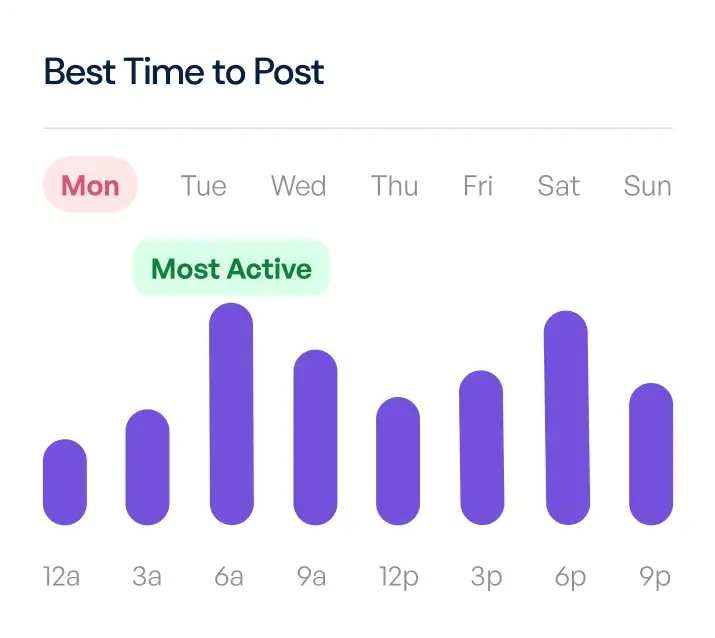

# Frontend Mentor - Bento grid solution

This is a solution to the [Bento grid challenge on Frontend Mentor](https://www.frontendmentor.io/challenges/bento-grid-RMydElrlOj). Frontend Mentor challenges help you improve your coding skills by building realistic projects. 

## Table of contents

- [Overview](#overview)
  - [The challenge](#the-challenge)
  - [Screenshot](#screenshot)
  - [Links](#links)
- [My process](#my-process)
  - [Built with](#built-with)
  - [What I learned](#what-i-learned)
  - [Continued development](#continued-development)
  - [Useful resources](#useful-resources)
- [Author](#author)
- [Acknowledgments](#acknowledgments)

**Note: Delete this note and update the table of contents based on what sections you keep.**

## Overview

### The challenge

Users should be able to:

- View the optimal layout for the interface depending on their device's screen size

### Screenshot

(./Frontend-Mentor-Bento-grid-03-14-2026_12_41_PM.png)

### Links

- Solution URL: [https://github.com/omobolarin1989/Bento-Grid)
- Live Site URL: [https://bucolic-bublanina-3e5d33.netlify.app/)

## My process

### Built with

- Semantic HTML5 markup
- Tailwind
- Flexbox
- CSS Grid
- Mobile-first workflow

- [[Tailwind CSS](https://tailwindcss.com/docs)) - For styles

**Note: These are just examples. Delete this note and replace the list above with your own choices**

### What I learned

Use this section to recap over some of your major learnings while working through this project. Writing these out and providing code samples of areas you want to highlight is a great way to reinforce your own knowledge.

To see how you can add code snippets, see below:

```html
. I learnt using CSS grid and tailwind. This really help making my work faster and easier

 <div class="bento-container p-[15px] md:mt-[60px] lg:p-[25px] md:p-[20px] sm:p-[10px] w-[100%] md:grid md:grid-row-4 md:grid-cols-4 lg:grid grid-row-8 grid-cols-1 lg:grid-cols-4 lg:grid-rows-6 font-DMSans lg:gap-5 gap-[20px]"> 
      
       <div class=" lg:py-[20px] py-[30px] lg:px-[20px] px-[20px] mx-auto lg:mx-[0px] p-[30px] lg:p-[10px] md:p-[0] bg-yellow-light md:row-span-[2] rounded-lg lg:row-span-[3] lg:col-span-[1] md:align-none md:justify-none md:flex md:flex-col md:justify-center md:align-center lg:flex lg:flex-col lg:justify-center">
         <p class="font-[500] lg:font-[500] text-[24px] text-[20px] w-[230px] md:w-[150px] lg:text-left md:text-center leading-[0.8em] lg:text-[35px] lg:font-[500] lg:w-[176px] lg:leading-[0.85em]">Create and schedule content <span class="text-purple text-DM-sans italic">quicker.</span></p>
         
       </div>
      
      <div class=" lg:m-[10px] m-auto p-[20px] lg:p-[0px] text-white font-[DMSans] bg-purple md:col-span-[2] md:row-span-[1] lg:row-span-[2] lg:col-span-[2] lg:flex lg:flex-col lg:justify-center lg:items-center rounded-lg">
        <p class="text-[24px] lg:text-[50px] lg:font-[500] mx-auto lg:mx-[0] w-[160px] lg:w-[450px] lg:text-center text-center lg:leading-[0.8em] md:pb-1">Social Media <span class="text-yellow">10x</span> <span class="text-DM-sans italic lg:text-[38px]">Faster</span> <span class="lg:text-[38px] lg:text-[Yellow]">with AI</span></p>
        
        <p class="text-[yellow-light] text-center md:mt-1 lg:mt-2">Over 4,000 5-star reviews</p>

      </div>

      <div class=" lg:row-span-[4] lg:col-span-[1] bg-purple-light lg:py-[35px] lg:px-[30px] p-[20px] rounded-lg">
        <p class="lg:text-[32px] lg:font[500] font-[500] lg:text-[26px] text-[21px] lg:font-[500] lg:w-[250px] lg:mb-[5px] mb-[14px] lg:leading-[0.85em]">Schedule to social media.</p>
          
        <p class="  lg:text-left text-center lg:w-[200px] lg:font-[500] font-[500] lg:text-[19px] leading-[1.1em] lg:leading-[1em] lg:font-[500] mt-[20px]">Optimise post timings to publish content at the perfect time for your audience.</p>
        
      </div>
```

### Continued development

I want to focus more on using the CSS grid and tailwind because it makes work easier and g=faster. Getting more understanding of this will make work very easy

### Useful resources

-([Tailwind](https://tailwindcss.com/docs/installation/using-vite)) - This helps in making the responsive design so easy. using various tailwind classes

- [Example resource 2](youtube.com) - Watching various video resource on youtube help me gain indepth understanding on how to go about it.


## Author

- Website - [Olaniyi Olatunbosun](https://bucolic-bublanina-3e5d33.netlify.app/)
- Frontend Mentor - [@omobolarin1989](https://www.frontendmentor.io/profile/omobolarin1989)


## Acknowledgments

I am writing to show gratiude to Future Firge learning initiative who brought this initiative to enable us learn more and know more. I am also thanking my Facilitators and Mentors. Ms. Blessing and Mr. Emmanuel. Thank you all for putting us on track.

